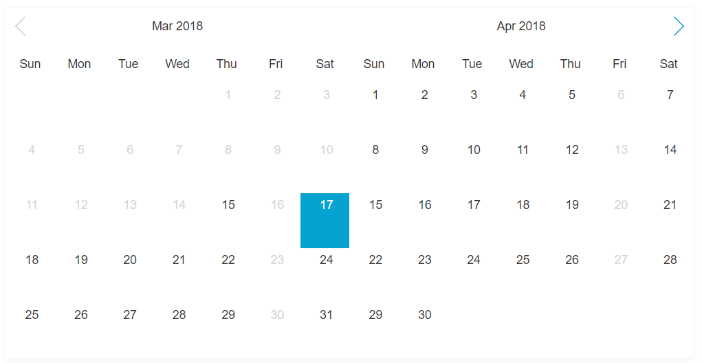
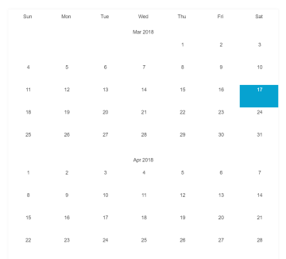

# DatePicker

DatePicker build with typescript

<table>
    <tr>
    <td colspan="2">
            <h4>Double views</h4>
            
        </td>
    </tr>
    <tr>
        <td valign="top">
            <h4>Single view</h4>
            
        </td>
        <td>
            <h4>Flat view</h4>
            
        </td>
    </tr>
    
</table>

## FEATURES

1.  Base on event
2.  Easy to display data on html element by using `data` event
3.  Support double views,flat view and single view
4.  Disabled date can be selected as end date while using `setData` function
5.  Support Multi selection

## RUN DEMO

    yarn dev or npm run dev 

## OPTIONS


| OPTION       | RERUIRED | TYPE               | DESC | DEFAULT VALUE         | 
|------------|------------ | ------------- |---------------|------------------|
| el           | YES      | string,HTMLElement | Element or selector to mount DatePcker  |    |                                       
| startDate    | NO       | Date               | Start date of DatePicker                                     | new Date              |
| endDate      | NO       | Date               | End date of DatePicker                                       | new Date() + 6 months |
| doubleSelect | NO       | boolean            | Enable pick two dates                                        | false                 |
| limit        | NO       | number             | Limitation between two dates while `doubleSelect` is on      |                       |
| views        | NO       | number,string      | Display views of DatePicker                                  | auto,1,2              |
| selection    | NO       | number             | Size of dates can be picked ,value must be not less than `2` | 1                     |
| months       | NO       | array<string>      | Month's name array                                           |                       |
| week         | NO       | array<string>      | Week's name array                                            |      
     |


#### NOTE

    when `selection` is greater than 2, `bindData` and `doubleSelect` will be set to `false`,
    and `option.limit` will be set the same as `selection`

## API

```typescript
   setDates([dates]:tuple);
   //Set  dates to DatePicker
   //dates accept <string> and <Date>

   setLanguage(language:any);
   //set DatePicker's language

   setData(callback)
   //set data to DatePicker
   //more detail see [USAGE]

   setDisabled({
        days?:Array<number>[5],
        dates?:Array<string|Date>,
        from?:<Date|string>,
        to?:<Date|string>
    })
   //Set disabled dates to DataPicker
   //dates =>dates accept <string> and <Date>,  all dates in [dates] will be disabled
   //days => days accept number of [0~6],   all days in [days] will be disabled
   //from => from accept <string> or <Date>, all dates after [from] date will be disabled,
   //        eg: from = 2018-3-31 => disabled from 2018-4-1  
   //to   => to accept <string> or <Date> all dates before [to] date will be disabled,
   //        eg: to =2018-3-4 => all dates before 2018-3-5 will be disabled

   parse(formattedDate:string,dateFormat:string)
   //Transform date string into date object,return Date object
   //eg: formattedDate ='2018-3-4',format='YYYY-M-D" =>  new Date(2018,2,4)

   format(date:Date,format:string)
   //Transform date object into string,return string  
   //eg: date =new Date(),format='YYYY-MM-DD' => 2018-03-04

   on(event:string,fn:Function)
   //Event listener
   //eg: datePicker.on("event",(result)=>{
                //your logic
   //    })
```

## USAGE

```typescript
    //es module
    import DatePicker from '/dist/datepicker.esm.js'
    import '/dist/style.css'

    //cjs
    const DatePicker =require("/dist/datepicker.js");
    require("/dist/style.css");


    //umd
    <script src="/dist/datepicker.min.js"></script>
    <link  href="/dist/style.css" rel="stylesheet"/>


    const date = new Date();
    const dist = {
           year: date.getFullYear(),
           month: date.getMonth(),
           date: date.getDate()
    };

    const from = new Date(dist.year, dist.month, dist.date)
    const to = new Date(dist.year, dist.month + 9, 0);
    const currDate = new Date(dist.year, dist.month, dist.date);

    //setup DatePicker instance
    const app = new DatePicker({
            el: document.getElementById("datepicker"),
            endDate:to,
            startDate:from,
            limit: 7,
            format: 'YYYY-M-D',
            doubleSelect: true,
            views: 1,
            selection:4 // if selection not less than 2, doubleSelect will be disabled,
                        //and `data` event and `setData` will not work
    });


    //do something when datepicker is ready
    app.on("ready",()=>{
       
        //currently,we support `custom` event 
       
       //`custom`event payload accepts `{type,value}`
       // currently 
       // `type` support string `custom`
       // `value` support <Date>
       //eg:render month name  outside datepicker
       let calendarHeaderTd = document.querySelectorAll("#calendar-header td");
        Array.prototype.slice.call(calendarHeaderTd).forEach(item => {
                item.addEventListener("click", () => {
                let data = item.dataset;
                app.emit("custom", {
                            type: "custom",
                            value: new Date(parseInt(data.year), parseInt(data.month) - 1, currDate.getDate())
                        })
                })
        })
    });

    //`update` event fired by click on date cell and DatePicker init
    app.on("update", (result) => {
        // result contains two keys, `value` and `type`
        // value =>  selected dates
        // type  =>  two types => `init` and `selected`
        // place your logic  here
        //eg:
        // document.getElementById("dates").innerText = value
    });

    // `disabled`event fired by `setDisabled`
    app.on("disabled", (result) => {
        // result contains two keys, `dateList` and `nodeList`
        const {dateList, nodeList} = result;
        for (let n = 0; n < nodeList.length; n++) {
            let node = nodeList[n];
            if (dateList[node.getAttribute("data-date")]) {
                node.classList.add('disabled')
            }
        }
    });
    // 'data' event fired by `setData`
    app.on("data", (result) => {
        //set HTML nodes states
        // result contains two keys, `data:any` and `nodeList:Array<string>`
            const data = result.data;
            const nodeList = result.nodeList;
            for (let i = 0; i < nodeList.length; i++) {
                let node = nodeList[i];
                let date = node.getAttribute("data-date");
                if (date in data) {
                    if (!node.classList.contains("disabled")) {
                        let itemData = source[date];
                        if (itemData.highlight) {
                            addClass(node, "highlight")
                        }
                        let placeholder = node.querySelector(".placeholder");
                        placeholder.innerHTML = itemData.value
                    }

                } else {
                    addClass(node, "disabled")
                }
            }
        });

       //tuple type,accept <string> and <Date>
       const selected=["2018-2-21",new Date()];
       //use `setDates` to set init dates to DatePicker instance
       app.setDates(selected);
       // use `setDisabled` to set specified date or day to disabled,
       // `setDisabled` accept an object => {dates,days},
       // <tuple>dates,accept <Date> and  <string>
       // <Array<number>>days accept 0,1,2,3,4,5,6
       app.setDisabled({
                dates: [
                    "2018-2-18",
                    "2018-2-19",
                    "2018-2-22",
                    new Date
                ],
                days: [1, 5, 2, 6],
                from:new Date(2018,2,10)
                to:'2018-7-15'
            });

        // To display your data,like price info on date cell,
        // use `setData` to pass data to `DatePicker` instance
        // `setData` function will dispatch `data` event
        // setup a listener to handle it
       app.setData(() => {
                    const data ={};
                    /*data accept Object like
                     {
                       "2018-1-31":{/*your codes * },
                       "2018-2-21":123,
                        }
                    */
                    //your logic here


                    //return data when your logic done
                    return data
        });

       //set DatePicker's language
       //language options
       const language={
                 days: ["Sun", "Mon", "Tue", "Wed", "Thu", "Fri", "Sat"],
                 months: ["Jan", "Feb", "Mar", "Apr", "May", "Jun", "Jul", "Aug", "Sep", "Oct", "Nov", "Dec"],
                 year: ""
       };
       app.setLanguage(language)
```

## TODO
1. year list panel
2. month list panel