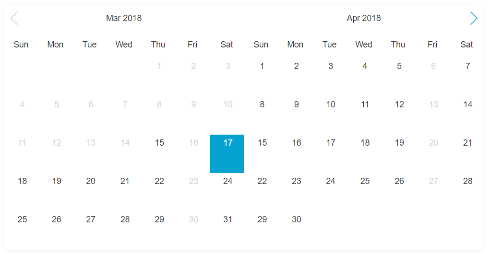
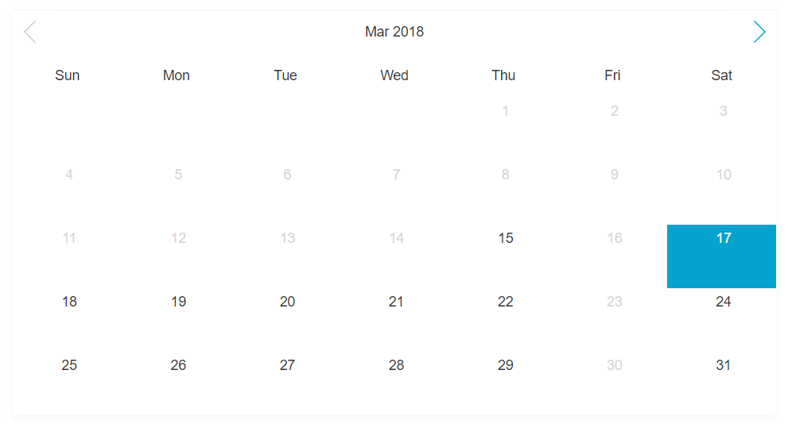
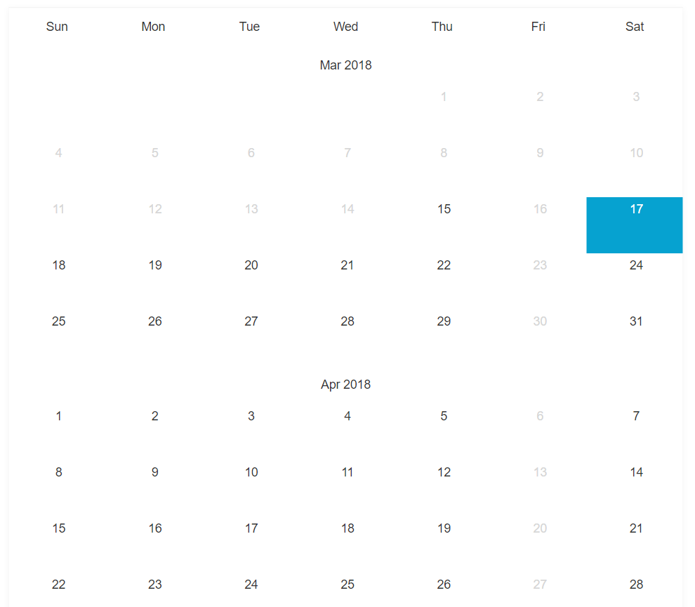

# TypePicker

DatePicker build with typescript

<table>
    <tr>
    <td colspan="2">
            <h4>Double views</h4>
            
        </td>
    </tr>
    <tr>
        <td valign="top">
            <h4>Single view</h4>
            
        </td>
        <td>
            <h4>Flat view</h4>
            
        </td>
    </tr>
    
</table>

## FEATURES

1.  Easy to display data on html element by using `render` event
2.  Support double views,flat view and single view
3.  Support Multi selection

## RUN DEMO

    yarn start or npm run start

## OPTIONS

| OPTION    | REQUIRED | TYPE               | DESC                                   | Default Value/Possible Value |
| --------- | -------- | ------------------ | -------------------------------------- | ---------------------------- |
| el        | YES      | string,HTMLElement | Element or selector to mount DatePcker |                              |
| format    | YES      | string             | Date string format                     | null                         |
| startDate | NO       | Date               | Start date of DatePicker               | new Date                     |
| endDate   | NO       | Date               | End date of DatePicker                 | null                         |
| limit     | NO       | number|bolean      | Limitation between two dates           | 1                            |
| views     | NO       | number,string      | Display views of DatePicker            | auto,1,2                     |
| selection | NO       | number             | Size of dates can be picked            | 1                            |

## API

```typescript
   public setDates([dates]:tuple);
   //Set  dates to DatePicker
   //dates accept <string> and <Date>
   //the datepicker i18n
   public i18n(language:any);

   public disable({
        days?:Array<number>,
        dates?:Array<string|Date>,
        from?:<Date|string>,
        to?:<Date|string>
    })
   //Set disabled dates to DataPicker
   //dates =>dates accept <string> and <Date>,  all dates in [dates] will be disabled
   //days => days accept number of [0~6],   all days in [days] will be disabled
   //from => from accept <string> or <Date>, all dates after [from] date will be disabled,
   //        eg: from = 2018-3-31 => disabled from 2018-4-1
   //to   => to accept <string> or <Date> all dates before [to] date will be disabled,
   //        eg: to =2018-3-4 => all dates before 2018-3-5 will be disabled

   public forceUpdate()
   //trigger rerender outside TypePicker instance 


   //Event listener
   //eg: datePicker.on("event",(result)=>{
                //your logic
   //    })
   public on(event:string,fn:Function)
```

## USAGE

```typescript
    //use build tools
    import TypePicker from '/dist/datepicker.esm.js'
    import '/dist/style.css'
    //not use build tools
    <script src="/dist/datepicker.min.js"></script>
    <link  href="/dist/style.css" rel="stylesheet"/>


    const date = new Date();
    const dist = {
           year: date.getFullYear(),
           month: date.getMonth(),
           date: date.getDate()
    };

    const from = new Date(dist.year, dist.month, dist.date)
    const to = new Date(dist.year, dist.month + 9, 0);
    const currDate = new Date(dist.year, dist.month, dist.date);
    //setup typePicker instance
    const app = new TypePicker({
            el: document.getElementById("datepicker"),
            endDate:to,
            startDate:from,
            limit: 7,
            format: 'YYYY-M-D',
            views: 1,
            selection:4
        });


    app.on("render", (nodeList) => {
       
        
        for (let i = 0; i < nodeList.length; i++) {
            let node = nodeList[i];
            let date = node.getAttribute("data-date");
            let disable =node.getAttribute('data-disabled');
           
           
            if(disable){
                disable =JSON.parse(disable)
            }
            
            
            let data =YOUR_SOURCE_WHATEVER_YOU_LIKE[date];
            //render your value to datepicker
            if(data&& !disable){
                node.querySelector(".placeholder").innerText = data.value;
            }

        }
    });

    //`select` event fired by click on date cell and DatePicker init
    app.on("select", (value) => {
        // place your logic  here
        //eg:
        // document.getElementById("dates").innerText = value
    });

    //tuple type,accept <string> and <Date>
    const selected=["2018-2-21",new Date()];
       //use `setDates` to set init dates to DatePicker instance
    app.setDates(selected);
       // use `setDisabled` to set specified date or day to disabled,
       // `setDisabled` accept an object => {dates,days},
       // <tuple>dates,accept <Date> and  <string>
       // <Array<number>>days accept 0,1,2,3,4,5,6
    const disabled ={
            dates: [
                "2018-2-18",
                "2018-2-19",
                "2018-2-22",
                new Date
            ],
            days: [1, 5, 2, 6],
            from:new Date(2018,2,10)
            to:'2018-7-15'
    }
    app.disable(disabled);
    //set DatePicker's language
    app.i18n({
            week:["Sun", "Mon", "Tue", "Wed", "Thu", "Fri", "Sat"],
            months:["Jan", "Feb", "Mar", "Apr", "May", "Jun", "Jul", "Aug", "Sep", "Oct", "Nov", "Dec"],
            title:"YYYY MM"
    })
    // if data changed ,you could use app.update() to rerender datepicker
    app.forceUpdate()


```
